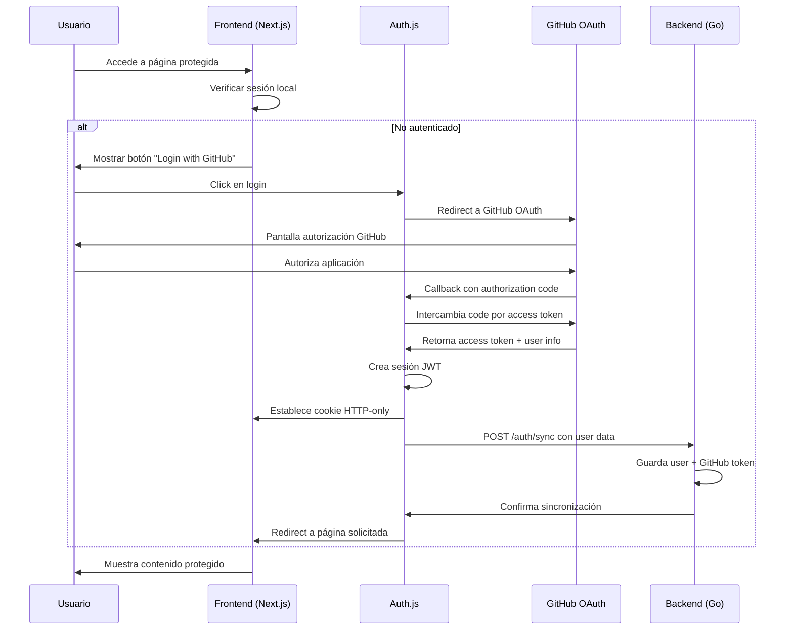
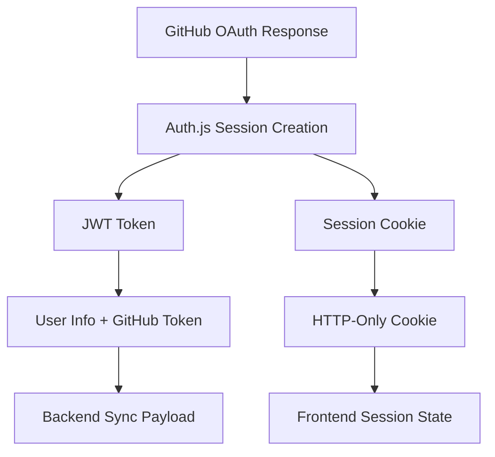
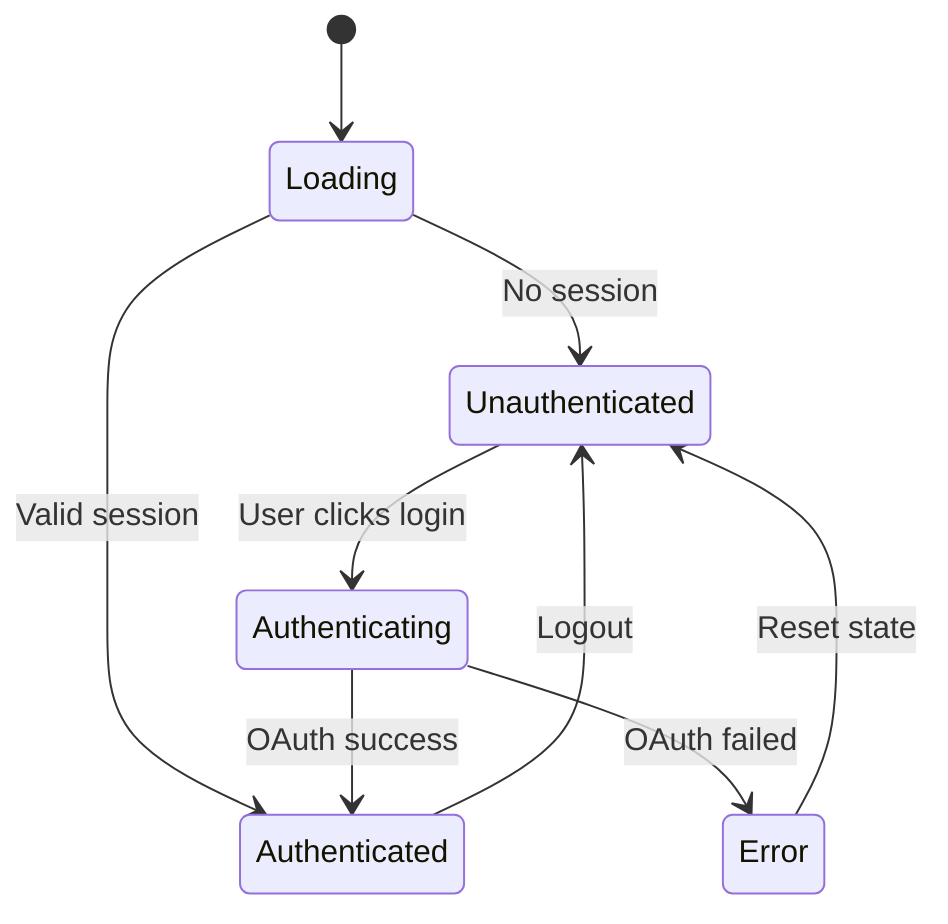
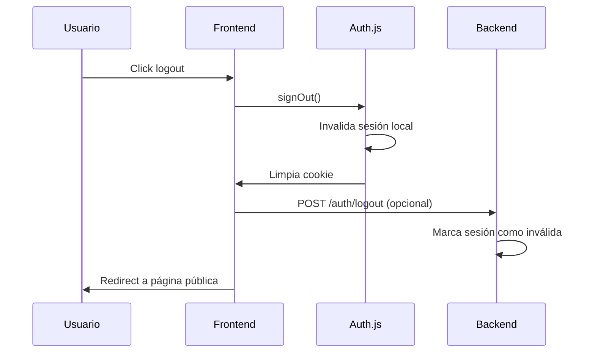

# Frontend Authentication Flow - Latens

## Contexto General

El frontend de Latens utiliza **Next.js 14** con **Auth.js** para manejar la autenticación OAuth con GitHub. La estrategia se basa en OAuth Apps (no GitHub Apps) para mantener simplicidad en el MVP y alineación con desarrolladores individuales.

## Dependencias Técnicas

### Core Dependencies
- **Next.js 14**: Framework React con App Router
- **Auth.js (NextAuth.js v5)**: Biblioteca de autenticación para Next.js
- **@auth/core**: Core de Auth.js con providers OAuth
- **jose**: Manejo de JWT tokens (dependencia de Auth.js)

### Configuración Requerida
- **GitHub OAuth App**: Aplicación registrada en GitHub Developer Settings
- **Environment Variables**: Client ID, Client Secret, NextAuth Secret
- **Callback URL**: `{domain}/api/auth/callback/github`

## Flujo de Autenticación Completo



## Arquitectura de Sesión

### Session Management
Auth.js maneja dos tipos de tokens internamente:



### Cookie Configuration
- **httpOnly**: `true` - No accesible desde JavaScript cliente
- **secure**: `true` - Solo HTTPS en producción
- **sameSite**: `'lax'` - Protección CSRF básica
- **maxAge**: 30 días (configurable)
- **path**: `/` - Disponible en toda la aplicación

## Callbacks y Hooks de Auth.js

### JWT Callback
Ejecutado cuando se crea o actualiza el JWT token. Aquí se:
- Agrega GitHub access token al JWT
- Incluye metadata del usuario (GitHub ID, username)
- Marca timestamp de última validación

### Session Callback  
Ejecutado en cada request que requiere sesión. Aquí se:
- Extrae información del JWT para la sesión frontend
- Filtra datos sensibles antes de enviar al cliente
- Puede implementar validación periódica del GitHub token

### SignIn Callback
Ejecutado después de login exitoso. Aquí se:
- Llama al endpoint `/auth/sync` del backend Go
- Sincroniza datos de usuario y GitHub token
- Maneja errores de sincronización

## Manejo de Estados de Autenticación

### Estados Posibles


### Hook useSession
Proporciona estado reactivo de autenticación:
- **status**: `"loading" | "authenticated" | "unauthenticated"`
- **data**: Objeto session con user info (sin tokens sensibles)
- **update**: Función para refrescar sesión

## Protección de Rutas

### Middleware Pattern
Next.js middleware intercepta requests para validar autenticación:
- Ejecuta en edge runtime para performance
- Verifica cookie de sesión antes de renderizar páginas
- Redirige a login si no autenticado
- Permite acceso a rutas públicas

### Page Protection
Páginas protegidas utilizan:
- **Server Components**: Verifican sesión server-side
- **Client Components**: Hook useSession para estado reactivo
- **Redirect Logic**: Automático a `/auth/signin` si no autenticado

## Integración con Backend

### Endpoint de Sincronización
**POST /auth/sync** - Llamado automáticamente después de OAuth:

**Request Headers**:
- `Content-Type: application/json`

**Request Body Schema**:
```json
{
  "github_id": string,      // GitHub user ID (e.g., "123456789")
  "username": string,        // GitHub username (e.g., "johndoe")
  "email": string | null,    // User email (can be null if private)
  "access_token": string,    // GitHub OAuth token (e.g., "ghp_xxxxxxxxxxxx")
  "avatar_url": string       // GitHub avatar URL
}
```

**Example Request Body**:
```json
{
  "github_id": "123456789",
  "username": "usuario",
  "email": "user@example.com",
  "access_token": "ghp_xxxxxxxxxxxx",
  "avatar_url": "https://avatars.githubusercontent.com/u/123456789"
}
```

**Security Note**: Este endpoint es llamado server-to-server desde Auth.js callbacks, nunca desde el cliente.

### Session Validation
Para requests a API protegidas, el frontend:
- Extrae session JWT de Auth.js
- Incluye en header `Authorization: Bearer {jwt}`
- Backend valida JWT y extrae user_id
- Backend obtiene GitHub token de base de datos

## Configuración de Desarrollo vs Producción

### Development
- **NEXTAUTH_URL**: `http://localhost:3000`
- **GitHub Callback**: `http://localhost:3000/api/auth/callback/github`
- **Secure Cookies**: `false`

### Production  
- **NEXTAUTH_URL**: `https://latens.io`
- **GitHub Callback**: `https://latens.io/api/auth/callback/github`
- **Secure Cookies**: `true`

## Error Handling

### OAuth Errors
- **Access Denied**: Usuario cancela autorización
- **Invalid Client**: Configuración incorrecta de OAuth App
- **Rate Limited**: Demasiados requests a GitHub

### Session Errors
- **JWT Expired**: Token local expirado (raro con configuración adecuada)
- **Invalid Signature**: JWT manipulado o secret cambiado
- **Sync Failed**: Backend no disponible durante login

## Consideraciones de Seguridad

### CSRF Protection
- Auth.js incluye protección CSRF automática
- Cookies con `sameSite: 'lax'`
- State parameter en OAuth flow

### XSS Protection
- Tokens nunca expuestos a JavaScript cliente
- HTTP-only cookies exclusivamente
- Sanitización de datos de usuario

### Token Storage
- GitHub access token NUNCA se almacena en frontend
- Solo session JWT en cookie HTTP-only
- Backend almacena GitHub tokens encriptados

## Flujo de Logout



## Performance y Caching

### Session Caching
- Auth.js cachea sesiones automáticamente
- Validación lazy en client-side
- Server-side validation en cada request protegido

### GitHub API Rate Limits
- Frontend NO hace calls directos a GitHub API
- Toda interacción vía backend para control centralizado
- Backend maneja rate limiting y caching